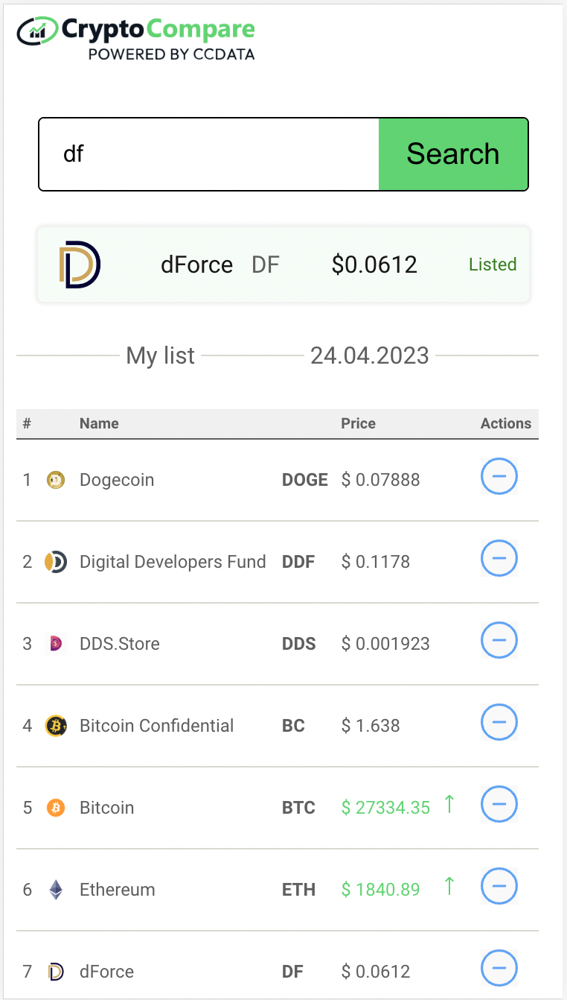

## Criss Cross Game

Live Site on Netlify: [https://cute-tulumba-66505c.netlify.app/](https://cute-tulumba-66505c.netlify.app/)

### Table of contents

- [Overview](#overview)

- [The challenge](#the-challenge)

- [Screenshot](#screenshot)

- [Links](#links)

- [My process](#my-process)

- [Built with](#built-with)

- [What I learned](#what-i-learned)

- [Continued development](#continued-development)

- [Useful resources](#useful-resources)

- [Author](#author)

- [Acknowledgments](#acknowledgments)

## Overview

Crypto Currency Rate follow app

### The challenge

Create an app that allows you to follow cryptocurrency exchange rate, using CryptoCompare service. For getting exchange rates you can use this API: https://min-api.cryptocompare.com/data/price?fsym=<NAME>&tsyms=USD&api_key=<API_KEY&gt; where NAME is the name of cryptocurrency.
For getting API_KEY you need to sign up here https://www.cryptocompare.com/
Your app should have an input for searching cryptocurrencies and a list of cryptocurrencies you already follow.

1. Initially your app has Dogecoin cryptocurrency in the list.
2. You can write another cryptocurrency name in the input and click on button 'Search'
3. After clicking this button you send a request for API
4. It such cryptocurrency exists, then you add it to your list (but if it is already in the list then adding not needed)
5. Every five seconds this list updates and shows if they grow or fall. when exchange rate is changed, you need to show this somehow to user (for instance, green or red arrows)
6. Every currency has a button 'delete'
   P.S. You don't need to use Redux for this task
7. My bonuses: local storage and all coins icons in the table, table scroll with sticky header

### Screenshot

### Links

- Solution GitHub: [https://github.com/vasily-mishanin/cryptocompare](https://github.com/vasily-mishanin/cryptocompare)

- Live Site on Netlify: [https://cute-tulumba-66505c.netlify.app/](https://cute-tulumba-66505c.netlify.app/)

## My process

### Built with

- Semantic HTML5 markup, canvas for strokes on the criss-cross field

- SCSS

- Flexbox, table

- Mobile-first workflow

- [React](https://reactjs.org/) - JS library to build UI

- [Vite](https://vitejs.dev/) - builder

### What I learned

- refresh good old classes on React
- refresh local storage API
- learn some new API

### Continued development

Finished for now, refactor after mentor's review

### Useful resources

https://www.cryptocompare.com/cryptopian/general

## Me

- Website - [vasmish.com](https://vasmish.com/)

- Twitter - [@MishaninVasily](https://twitter.com/MishaninVasily)

## Acknowledgments
